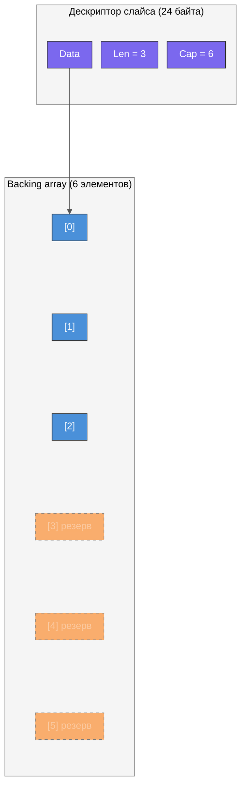
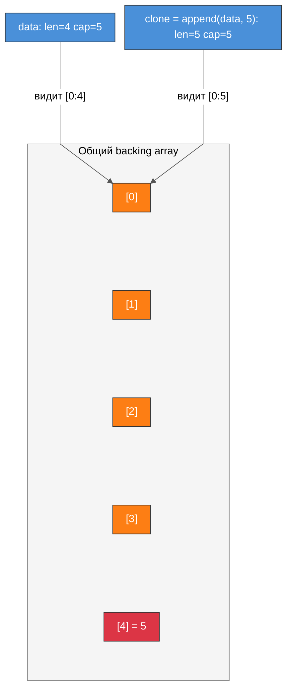
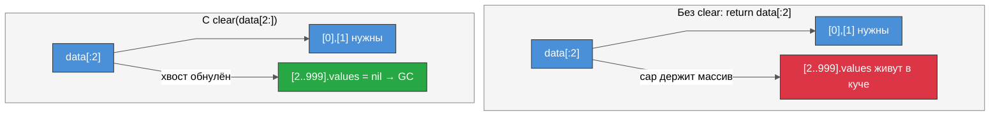

# Урок 1. Массивы и слайсы в Go

## 🎯 Цели урока

- Понять внутреннее устройство массивов и слайсов на уровне памяти
- Разобраться с тремя полями дескриптора слайса и их семантикой
- Освоить все операции со слайсами: append, copy, slicing, three-index slicing
- Научиться избегать классической ловушки «опасного append» при разделяемом backing array
- Понять алгоритм роста capacity и почему предвыделение памяти критично для производительности
- Разобраться с BCE (Bounds Check Elimination) и научиться помогать компилятору
- Изучить нюансы итерации: range по массиву vs слайсу, range по указателю, бесконечный range

---

## 📚 Теория

### 1. Массивы: значение, тип, память

Массив в Go — это не указатель, как в C. Это непрерывный участок памяти, хранящий фиксированное количество элементов одного типа. Ключевая особенность: **размер является частью типа**. `[3]int` и `[4]int` — это два разных, несовместимых типа, как `int` и `string`. Это означает, что функция, принимающая `[3]int`, не примет `[4]int`.

Массив объявляется через `var arr [5]int` (нулевые значения), `arr := [5]int{1, 2, 3}` (остаток — нули) или `arr := [...]int{1, 2, 3}` (компилятор выводит размер из количества элементов). Синтаксис `arr := [5]int{2: 5, 0: 7}` позволяет инициализировать конкретные индексы, но читается плохо — лучше избегать.

В памяти массив выглядит как плоский блок байт. Адрес массива совпадает с адресом первого элемента. Доступ к элементу по индексу `i` — это `адрес_начала + i * sizeof(T)`. Длина массива нигде не хранится рядом с данными — она известна компилятору из типа, поэтому `len(arr)` для массива заменяется константой на этапе компиляции.

Выход за границы массива — это `panic` в рантайме (если индекс — переменная) или ошибка компиляции (если индекс — константа). Отрицательные индексы в Go запрещены синтаксически, в отличие от Python. Массивы можно сравнивать через `==` поэлементно, операторы `<`, `>` — недоступны. Массив не может быть `nil`, поскольку это значение, а не ссылка.

Где выделяется память: если размер массива меньше ~10 МБ и он не «убегает» (escape analysis), массив живёт на стеке горутины. Иначе — в куче. Важный нюанс: стек горутины может расширяться, и тогда массив «переезжает» в памяти — хранить адрес элемента массива между вызовами опасно. Массив из пустых структур (`[1e6]struct{}`) занимает ноль байт — компилятор оптимизирует это.

Передача массива в функцию **копирует весь массив**. Для массива на миллион int это 8 МБ лишней работы за один вызов. Чтобы избежать копирования, используйте указатель на массив (`*[1e6]int`) или слайс.

> см. `deep_lessons/lesson_1/examples/01_array_basics/main.go`

---

### 2. Слайс: дескриптор из трёх полей

Слайс — это не динамический массив сам по себе. Это **дескриптор** (struct из трёх полей), который описывает «вид» на существующий массив:

```
type SliceHeader struct {
    Data uintptr  // указатель на первый доступный элемент в backing array
    Len  int      // количество доступных элементов
    Cap  int      // количество элементов от Data до конца backing array
}
```

Размер этого дескриптора — три машинных слова (24 байта на 64-bit). Передача слайса в функцию копирует только этот дескриптор, а не данные — это быстро. Но именно из-за этого изменения элементов внутри функции **видны снаружи** (оба дескриптора указывают на одни данные), а изменения `len` и `cap` через `append` снаружи **не видны** (изменился только локальный дескриптор).

Нулевое значение слайса — `nil`: все три поля равны нулю. С `nil`-слайсом можно вызывать `append` и итерироваться через `range` без паники, но обращение по индексу (`s[0]`) немедленно паникует.

`make([]int, 5)` создаёт backing array из 5 элементов и возвращает дескриптор с `len=5, cap=5`. `make([]int, 3, 6)` создаёт backing array из 6 элементов, но дескриптор показывает только первые 3 через `len`. Оставшиеся 3 позиции (4-я, 5-я, 6-я) доступны через `cap` — именно туда `append` запишет данные без аллокации.

Аллокация слайса: `make([]byte, 64<<10)` (64 КБ) живёт на стеке, `make([]byte, 64<<10+1)` (64 КБ + 1 байт) уже уходит в кучу. Точные пороги зависят от версии компилятора и могут меняться. Если размер слайса задан переменной (`make([]byte, n)`) — он всегда уходит в кучу, потому что компилятор не знает размер на этапе компиляции.

Диаграмма показывает дескриптор `make([]int, 3, 6)`: три фиолетовых слова (`Data/Len/Cap`) — это сам слайс, а `Data` указывает в начало backing array. Синие ячейки доступны через индекс (`len=3`), оранжевые-пунктирные существуют физически и зарезервированы под будущий `append` (`cap=6`), но обращение к ним по индексу — паника.



> см. `deep_lessons/lesson_1/examples/02_slice_internals/main.go`

---

### 3. nil-слайс vs empty-слайс

Различие между nil-слайсом и пустым слайсом — одна из самых частых точек путаницы. Рассмотрим все четыре способа создать «пустой» слайс:

- `var s []string` — nil-слайс. `s == nil` → true. `len=0, cap=0`. Указатель Data == 0 (нулевой указатель).
- `s = []string(nil)` — то же самое, явный nil-слайс.
- `s = []string{}` — empty-слайс. `s == nil` → false. `len=0, cap=0`. Указатель Data ненулевой (указывает на специальный «zero-size» объект).
- `s = make([]string, 0)` — аналогично `[]string{}`, empty-слайс.

На практике для большинства операций (`append`, `range`, `len`, `copy`) nil-слайс и empty-слайс ведут себя одинаково. Разница проявляется при:
- сравнении `s == nil` (nil-слайс → true, empty → false)
- сериализации в JSON: `json.Marshal` вернёт `"null"` для nil-слайса и `"[]"` для empty-слайса
- явных проверках в API, где разработчик различает «не задано» (nil) и «задано пустым» (empty)

Рекомендация: возвращайте `nil`-слайс из функций при «пустом» результате — это идиоматично в Go и не требует лишней аллокации.

> см. `deep_lessons/lesson_1/examples/03_nil_vs_empty/main.go`

---

### 4. Операции срезания (slicing) и three-index slicing

Срезание `s[low:high]` возвращает новый дескриптор, указывающий на тот же backing array:
- `len = high - low`
- `cap = cap(s) - low`
- `Data = s.Data + low * sizeof(T)`

Это операция O(1) без аллокации — возвращается просто новый дескриптор. Границы: `0 ≤ low ≤ high ≤ cap(s)`. Выход за `cap` — panic в рантайме, `low > high` — panic (или ошибка компиляции для констант).

Нюансы: `s[2:]` — от третьего элемента до конца (len-2 элементов, cap-2 capacity). `s[:3]` — первые три элемента, но cap остаётся исходным. `s[:]` — полная копия дескриптора, тот же backing array.

**Three-index slicing** `s[low:high:max]` — расширение синтаксиса, доступное с Go 1.2. Ограничивает capacity результата: `cap = max - low`. Зачем? Если передать подслайс в функцию, которая делает `append`, без ограничения capacity она может перетереть данные за пределами `high` в исходном массиве. С `s[low:high:high]` (полный full slice expression) capacity результата равен len, и `append` гарантированно выделит новый массив.

Пример: из слайса `data` длиной 100 и capacity 200, срезаем `data[10:20]`. Новый дескриптор: `len=10, cap=190`. Если передать этот подслайс в функцию и там сделать `append`, данные запишутся в позиции 20–190 исходного массива. Это может быть незаметно и привести к тонкому багу. `data[10:20:20]` решает проблему: `cap=10`, `append` аллоцирует новый массив.

Расширить capacity через срезание нельзя: `s[:cap(s)+1]` — всегда panic. Для расширения нужен `append` или `slices.Grow`.

> см. `deep_lessons/lesson_1/examples/04_slice_operations/main.go`

---

### 5. append и алгоритм роста capacity

`append(slice, elems...)` добавляет элементы в конец. Если `len < cap` — просто записывает данные в backing array и возвращает дескриптор с увеличенным `len`. Это O(1) без аллокации.

Если `len == cap` — происходит **реаллокация**:
1. Вычисляется новый capacity (алгоритм ниже)
2. Выделяется новый backing array
3. Старые элементы копируются (`copy`)
4. Добавляются новые элементы
5. Возвращается новый дескриптор

Старый backing array перестаёт быть доступен через новый слайс. Если на него больше нет ссылок, GC его соберёт.

**Алгоритм роста capacity (Go 1.18+)**: до версии Go 1.17 включительно работал порог «если cap < 1024, удваивай; иначе расти на 25%». Начиная с 1.18, алгоритм плавный: он начинается с коэффициента ~2x для маленьких слайсов и постепенно снижается до ~1.25x для больших. Конкретные цифры зависят от размера элементов и округления до размеров классов памяти аллокатора. Важно понимать: **точный коэффициент не задокументирован и может меняться между версиями Go** — не полагайтесь на него в логике программы.

Реализацию `append` можно представить так (упрощённо):
```go
func Append(slice []int, data ...int) []int {
    newLen := len(slice) + len(data)
    if newLen > cap(slice) {
        newCap := max(len(slice)*2, 1)
        newSlice := make([]int, newCap)
        copy(newSlice, slice)
        slice = newSlice
    }
    slice = slice[:newLen]
    copy(slice[len(slice)-len(data):], data)
    return slice
}
```

Критически важно: `append` **всегда возвращает новый дескриптор** — используйте возвращаемое значение! Паттерн `append(s, x)` без присваивания — это классическая ошибка.

Схема ниже разделяет две ветки `append`. Дешёвая (`len < cap`) — просто запись в backing array. Дорогая (`len == cap`) — аллокация нового массива, копирование всех элементов и сборка старого; именно поэтому результат `append` обязательно присваивают обратно — после реаллокации `Data` указывает уже на новый массив.

```mermaid
%%{init: {
  "flowchart": {
    "curve": "linear",
    "nodeSpacing": 15,
    "rankSpacing": 120,
    "padding": 10,
    "htmlLabels": true
  },
  "theme": "base",
  "themeVariables": {
    "clusterBkg": "#f5f5f5",
    "clusterBorder": "#888",
    "nodeBorder": "#333",
    "nodeTextColor": "#000",
    "edgeStrokeWidth": "1.5",
    "lineColor": "#555",
    "primaryColor": "#fff",
    "primaryBorderColor": "#333",
    "primaryTextColor": "#000"
  }
}}%%
graph LR
    start["append(s, x)"]
    check{"len < cap ?"}
    write["записать в backing array"]
    inclen["len++"]
    newcap["вычислить новый cap"]
    alloc["выделить новый массив"]
    copyel["copy старых элементов"]
    gc["старый массив → GC"]
    done["вернуть новый дескриптор"]

    start --> check
    check -->|"да"| write
    write --> inclen --> done
    check -->|"нет"| newcap
    newcap --> alloc --> copyel --> gc --> done

    classDef code fill:#4a90d9,color:#fff
    classDef cond fill:#7b68ee,color:#fff
    classDef mem fill:#fd7e14,color:#fff
    classDef ok fill:#28a745,color:#fff

    class start,write,inclen code
    class check cond
    class newcap,alloc,copyel,gc mem
    class done ok
```



> см. `deep_lessons/lesson_1/examples/05_append_growth/main.go`

---

### 6. Опасный append: ловушка разделяемого backing array

Это одна из самых коварных ловушек в Go. Два слайса могут указывать на один backing array — после операции срезания или передачи в функцию. Если у одного из них есть свободная capacity, `append` запишет данные прямо в backing array, затирая данные второго слайса.

Сценарий:
```
data := make([]int, 4, 5)  // backing array: [0,0,0,0,_], len=4, cap=5
clone := append(data, 5)   // записывает 5 в позицию 4, backing array: [0,0,0,0,5]
// data всё ещё указывает на тот же массив! data[:5] покажет [0,0,0,0,5]
```

Здесь `data` и `clone` разделяют backing array, пока у `data` есть запас capacity. Стоит изменить `clone[0] = 99` — и `data` об этом не узнает через свой дескриптор (потому что `data.len == 4`), но данные в backing array изменились.

Как защититься:
1. **`copy`**: создаёт новый слайс с независимым backing array.
   ```go
   clone := make([]int, len(data))
   copy(clone, data)
   ```
2. **Идиома `append([]T(nil), data...)`**: то же что copy, но короче.
3. **Full slice expression `data[:len(data):len(data)]`** при срезании: ограничивает capacity подслайса до его len, так что ближайший же `append` в подслайсе вызовет реаллокацию и разделит backing array.

Аналогия: представьте два бухгалтера, которым дали разные листы, но на самом деле они пишут на одном листе через копирку. Первый бухгалтер видит только первые 4 строки, второй — все 5. Когда второй пишет в 5-ю строку, первый не знает, что данные под ним изменились.

На диаграмме `data` (len=4, cap=5) и `clone = append(data, 5)` делят один backing array, пока у `data` оставался запас ёмкости. `clone` видит все 5 ячеек, `data` — только первые 4, но физически данные общие: запись через `clone` молча меняет то, что лежит «под» `data`.



> см. `deep_lessons/lesson_1/examples/06_dangerous_append/main.go`

---

### 7. Three-index slicing как защита от опасного append

Three-index slicing `s[low:high:max]` — главный инструмент защиты при передаче подслайсов. Если функция получила подслайс с `cap > len`, она может незаметно затереть данные за его пределами через `append`.

Паттерн безопасной передачи подслайса:
```go
// Небезопасно: capacity подслайса = cap(data) - 2
sub := data[2:5]
process(sub) // process может затереть data[5:]

// Безопасно: capacity подслайса = 5-2 = 3, равен len
sub := data[2:5:5]
process(sub) // append внутри process аллоцирует новый массив
```

Ещё один приём: `slices.Clip(s)` эквивалентен `s[:len(s):len(s)]` и уменьшает cap до len в дескрипторе. Важно: `slices.Clip` **не освобождает память** backing array — старый массив продолжает существовать в куче, пока кто-то хранит дескриптор с большим cap. Чтобы реально освободить память большого backing array и оставить только нужные элементы, нужно скопировать данные в новый слайс:
```go
// Реальное освобождение памяти большого backing array:
small := make([]T, len(big))
copy(small, big)
big = nil // старый массив теперь недостижим для GC
```

Это особенно важно в ситуации «большой слайс данных, нужен маленький подслайс»: если вернуть `data[i:i+20]` из функции, вся гигабайтная аллокация data будет жить в памяти, пока живёт этот маленький дескриптор.

> см. `deep_lessons/lesson_1/examples/07_three_index_slicing/main.go`

---

### 8. copy: семантика и нюансы

`copy(dst, src)` копирует `min(len(dst), len(src))` элементов из `src` в `dst` и возвращает количество скопированных элементов.

Главный нюанс: если `dst` — nil-слайс или слайс нулевой длины, ничего не скопируется. Типичная ошибка:
```go
src := []int{1, 2, 3}
var dst []int
copy(dst, src)  // скопировано 0 элементов! dst всё ещё nil
```

Правильно:
```go
dst := make([]int, len(src))
copy(dst, src)  // скопировано 3 элемента
```

Под капотом `copy` использует оптимизированную функцию `memmove` из рантайма — это не поэлементный цикл на Go, а оптимизированный ассемблер. `copy` безопасно работает при перекрывающихся диапазонах памяти (что бывает при срезании одного массива).

`copy` также работает для копирования строки в `[]byte`:
```go
buf := make([]byte, len(str))
copy(buf, str)  // строка → байтовый слайс без дополнительной аллокации
```

> см. `deep_lessons/lesson_1/examples/08_copy_slice/main.go`

---

### 9. Слайс слайсов и утечки памяти через backing array

Слайс структур, где каждая структура содержит слайс — частый паттерн. Пример: `[]Data` где `Data.values []byte`. Если вернуть только первые два элемента из тысячи через `data[:2]`, backing array из 1000 элементов никуда не денется из памяти — GC не соберёт его, потому что дескриптор `data[:2]` держит ссылку на него через `cap`.

Но и сами слайсы `data[2:]...data[999:].values` — это отдельные аллокации в куче. Даже если уменьшить cap до 2, данные в `values` у элементов 2-999 останутся в куче.

Правильное решение — явно обнулить «хвост»:
```go
clear(data[2:])     // обнуляет все поля, включая указатели values
return data[:2]     // теперь data[2:999].values недостижимы для GC
```

Функция `clear(s)` (Go 1.21+) заполняет слайс нулевыми значениями, обнуляя все указатели — это позволяет GC собрать связанные аллокации. Для слайса числовых типов компилятор транслирует `clear(s)` в оптимизированный вызов `memclr` — очень быстро.

Диаграмма противопоставляет два исхода. Слева `return data[:2]` без зачистки: дескриптор держит весь backing array, а элементы `[2:]` через свои поля `values` удерживают отдельные кучи-аллокации — GC бессилен (красная зона). Справа `clear(data[2:])` обнуляет указатели в хвосте, и связанные аллокации становятся недостижимыми и собираются (зелёная зона).



> см. `deep_lessons/lesson_1/examples/09_slice_of_slices/main.go`

---

### 10. Итерация: range, указатели на массив, бесконечный range

**range по массиву** делает копию массива. Это важно: изменение элементов через переменную `v` в `for i, v := range arr` не влияет на исходный массив. С Go 1.22 для каждой итерации создаётся новая переменная `v` с новым адресом (до 1.22 адрес был одним и тем же — частая ловушка при захвате `&v` в горутины или замыкания).

```go
data := [...]int{1, 2, 3}
for v := range data           // копия массива
for v := range &data          // без копии, работа с оригиналом
for v := range data[:]        // без копии (слайс — дескриптор, не данные)
```

**range по nil-указателю на массив**: `var p *[4]int = nil`. `len(p)` и `cap(p)` равны 4 даже для nil-указателя — это нормально. `for idx := range p` — паники нет, итерации не будет. Но `for idx, v := range p` — **panic при разыменовании nil-указателя**.

**range по слайсу**: выражение в `range` вычисляется один раз до начала цикла. `for range data { data = append(data, 10) }` — **не бесконечный цикл**: range зафиксировал `len(data)` при старте. Цикл выполнится ровно `len(data)` раз в момент старта.

Противоположность: `for i := 0; i < len(data); i++ { data = append(data, 10) }` — бесконечный цикл, потому что `len(data)` вычисляется на каждой итерации.

**Производительность**: итерация по индексу (`arr[i]`) быстрее, чем по указателям, из-за лучшего cache locality — элементы лежат в памяти последовательно.

> см. `deep_lessons/lesson_1/examples/10_range_variations/main.go`

---

### 11. BCE: Bounds Check Elimination

При каждом обращении `s[i]` компилятор Go вставляет проверку: `if i >= len(s) { panic(...) }`. Это называется bound check. В горячем цикле это существенные накладные расходы.

**BCE (Bounds Check Elimination)** — оптимизация компилятора, которая доказывает статически, что индекс всегда в допустимых границах, и убирает проверку. Посмотреть, где проверки остались, можно командой:
```
go run -gcflags="-d=ssa/check_bce" main.go
```
Каждая строка `Found IsInBounds` — это проверка, которую компилятор НЕ смог убрать.

Когда BCE работает автоматически:
- `for i := range s { _ = s[i] }` — компилятор знает, что `i < len(s)`, проверки нет
- `for i := 0; i < len(s); i++ { _ = s[i] }` — аналогично

Когда BCE не срабатывает и нужна помощь:
```go
// Без подсказки: каждое обращение values[i] внутри цикла проверяется
func sum1(values []int, size int) int {
    sum := 0
    for i := 0; i < size; i++ {
        sum += values[i]  // bound check на каждой итерации
    }
    return sum
}

// С подсказкой: одна проверка до цикла, в цикле — ноль
func sum2(values []int, size int) int {
    _ = values[size-1]  // BCE-хинт: доказываем, что size-1 < len
    sum := 0
    for i := 0; i < size-1; i++ {
        sum += values[i]  // проверок нет
    }
    return sum
}
```

Трюк: перед циклом делается одно обращение к последнему ожидаемому индексу. Компилятор видит, что эта проверка уже была, и убирает остальные. Это паттерн для горячих путей обработки данных.

> см. `deep_lessons/lesson_1/examples/11_bce_basics/main.go`

---

### 12. Предвыделение памяти и оптимизации

**Предвыделение через make([]T, 0, n)**: если вы знаете или можете оценить итоговый размер слайса, передайте его как третий аргумент `make`. Это предотвращает реаллокации в процессе `append`. При размере N реаллокаций будет порядка log₂(N) без предвыделения и 0 с предвыделением. На практике это может дать 2–5x ускорение для горячего кода.

```go
// Плохо: каждый append потенциально вызывает реаллокацию
result := []int{}
for _, v := range input {
    if condition(v) {
        result = append(result, v)
    }
}

// Хорошо: максимум одна аллокация
result := make([]int, 0, len(input))
for _, v := range input {
    if condition(v) {
        result = append(result, v)
    }
}
```

**collection_optimization**: если надо выделить слайс на 2+ гигабайта, `make([]byte, 1<<31)` делает одну аллокацию всей памяти сразу. Память запрашивается у ОС и обнуляется. Это может быть дешевле серии мелких аллокаций для горячих путей.

**memclr-оптимизация**: цикл `for i := range s { s[i] = 0 }` компилятор распознаёт как паттерн очистки и заменяет на оптимизированный `memclr` из рантайма. В Go 1.21+ функция `clear(s)` делает это явно и читаемо. Никогда не пишите очистку вручную — используйте `clear`.

**«Грязный» слайс**: чтобы избежать обнуления памяти при создании большого слайса (например, для буфера, который сразу будет заполнен), существуют трюки через `strings.Builder` и `unsafe`. Это сложно, опасно и нужно крайне редко — только если профилировщик показывает, что именно инициализация является узким местом.

> см. `deep_lessons/lesson_1/examples/12_preallocation/main.go`

---

## 🧪 Практика

### Задание 1: Фильтрация чётных чисел

Реализуйте функцию `FilterEvens(input []int) []int`, которая возвращает новый слайс, содержащий только чётные числа из входного. Функция не должна модифицировать входной слайс.

Требования:
- Предвыделите capacity для результата
- Обработайте nil-слайс на входе
- Напишите несколько тест-кейсов в `main`

> 💡 Подсказка: сколько максимум элементов может оказаться в результате? Используйте это для предвыделения.

> см. `deep_lessons/lesson_1/practice/01_filter_evens/main.go`

---

### Задание 2: Дедупликация отсортированного слайса

Реализуйте функцию `Dedup(s []int) []int`, которая удаляет дублирующиеся элементы из **отсортированного** слайса. Верните новый слайс только с уникальными элементами в том же порядке.

Требования:
- Решите задачу **без дополнительной аллокации** — работайте in-place, используя три-индексное срезание в конце
- Обработайте пустой и nil-слайс
- Проверьте, что исходный слайс не изменился через backing array (используйте full slice expression)

> 💡 Подсказка: держите «указатель записи» `write` и сравнивайте каждый элемент с предыдущим записанным.

> см. `deep_lessons/lesson_1/practice/02_dedup_sorted/main.go`

---

### Задание 3: Главная диагональ матрицы

Реализуйте функцию `MainDiagonal(matrix [][]int) []int`, которая извлекает главную диагональ квадратной матрицы (элементы с одинаковыми индексами строки и столбца).

Требования:
- Матрица представлена как `[][]int` (слайс слайсов)
- Если матрица не квадратная — верните `nil`
- Если матрица пустая — верните `nil`
- Используйте предвыделение для результата
- В `main` создайте матрицы разных размеров и проверьте результат

> 💡 Подсказка: квадратная матрица удовлетворяет условию `len(matrix[i]) == len(matrix)` для всех строк `i`.

> см. `deep_lessons/lesson_1/practice/03_matrix_diagonal/main.go`

---

## 🏠 Домашнее задание: Кольцевой буфер на слайсе

Реализуйте структуру `RingBuffer[T any]` — кольцевую очередь фиксированного размера на основе слайса. Эта структура эффективно решает проблему «медленного pop front» у обычного слайса, работая как очередь FIFO за O(1) на каждую операцию.

**Интерфейс:**
```go
type RingBuffer[T any] struct { /* ваши поля */ }

func NewRingBuffer[T any](capacity int) *RingBuffer[T]
func (rb *RingBuffer[T]) Push(v T) error      // добавить в конец; error если буфер полон
func (rb *RingBuffer[T]) Pop() (T, error)     // извлечь из начала; error если буфер пуст
func (rb *RingBuffer[T]) Len() int            // текущее количество элементов
func (rb *RingBuffer[T]) Cap() int            // ёмкость буфера
func (rb *RingBuffer[T]) IsFull() bool
func (rb *RingBuffer[T]) IsEmpty() bool
```

**Алгоритм**: используйте два индекса `head` (начало) и `tail` (следующая позиция для записи) и слайс фиксированной длины. При достижении конца слайса индексы «оборачиваются» через `% capacity`.

**Критерии:**
- [ ] Все операции работают за O(1)
- [ ] Корректно обрабатываются edge cases: push в полный буфер, pop из пустого
- [ ] `Push` и `Pop` работают корректно после «оборачивания» индексов
- [ ] Не используется `append` (буфер фиксированного размера, слайс создаётся один раз в `NewRingBuffer`)
- [ ] Реализованы дженерики (Go 1.21+)
- [ ] В `main` — демонстрация: записать больше, чем capacity, убедиться в корректных ошибках

> см. `deep_lessons/lesson_1/homework/01_ring_buffer/main.go`

---

## ⚠️ Частые ошибки

- **Ошибка: игнорирование возвращаемого значения append.**
  `append(s, x)` без `s = ...` — данные добавляются, но исходный дескриптор не обновляется. При реаллокации результат полностью теряется.

- **Ошибка: копирование в nil/пустой dst через copy.**
  `var dst []int; copy(dst, src)` — скопирует 0 элементов. `copy` ограничен `min(len(dst), len(src))`. Сначала создайте dst нужного размера.

- **Ошибка: скрытое разделение backing array после срезания.**
  `sub := data[2:5]` шарит массив с `data`. Append в `sub` при наличии capacity перетирает `data[5:]`. Используйте `data[2:5:5]` или явный `copy`.

- **Ошибка: утечка большого массива через маленький подслайс.**
  `return bigData[i:i+10]` — весь `bigData` остаётся в памяти. Скопируйте нужное через `make` + `copy`.

- **Ошибка: изменение элементов массива через range-переменную.**
  `for _, v := range arr { v = 0 }` — изменяет локальную копию. Используйте `arr[i] = 0` или `for i := range arr`.

- **Ошибка: бесконечный цикл с len(s) в условии while-стиля.**
  `for i := 0; i < len(s); i++ { s = append(s, x) }` — бесконечный цикл. `for range s` этой проблемы не имеет.

- **Ошибка: отсутствие предвыделения в горячем коде.**
  Серия `append` без `make([]T, 0, n)` вызывает log₂(N) реаллокаций с копированием всех данных. Для слайса из миллиона элементов это ~20 лишних аллокаций и копирований.

- **Ошибка: slices.Clip как «освобождение памяти».**
  `slices.Clip(s)` уменьшает cap в дескрипторе, но старый backing array в памяти остаётся — GC его не соберёт, пока живёт хоть один дескриптор с большим cap. Для реального освобождения используйте `append([]T(nil), s...)`.

---

## 🔗 Документация

- [pkg.go.dev/slices](https://pkg.go.dev/slices) — стандартная библиотека `slices` (Go 1.21+): Clip, Grow, Delete, Contains и другие утилиты для слайсов
- [Go Spec — Array types](https://go.dev/ref/spec#Array_types) — формальная спецификация массивов: синтаксис, типизация, семантика
- [Go Spec — Slice types](https://go.dev/ref/spec#Slice_types) — спецификация слайсов: внутренняя структура, full slice expression
- [Go Spec — Appending and copying slices](https://go.dev/ref/spec#Appending_and_copying_slices) — спецификация append и copy
- [Go Blog — Arrays, slices (and strings): The mechanics of 'append'](https://go.dev/blog/slices-intro) — Rob Pike о механике append, backing array, copy
- [Go Blog — Go Slices: usage and internals](https://go.dev/blog/slices) — подробно о внутреннем устройстве слайсов от команды Go
- [Go Wiki — Slice Tricks](https://go.dev/wiki/SliceTricks) — идиоматические паттерны: delete, insert, reverse, dedup
